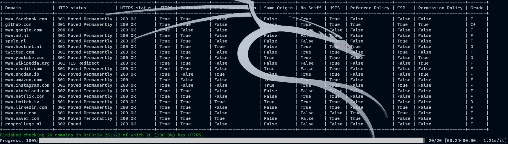

# https_test

***

Test a list with websites for http/https.
Note that you can DNS spoof pages that return "HTTP 200 OK", such as Google or LinkedIn.

To prevent DNS spoofing on your device, use the "HTTPS Everywhere" plugin for your browser.
This plugin is also available for Firefox on mobile devices.


Installation:
```Shell
apt install python3-pip
```

```Shell
pip3 install -r required.txt
```

```Shell
chmod +x test.py
./test.py -h
```

Windows:
```Shell
py test.py -h
```

Usage:
```Shell
usage: HTTPS Test [-h] [-f FILE] [-d DOMAIN]

optional arguments:
  -h, --help            show this help message and exit
  -f FILE, --file FILE  Location to domain list. Example: -f ./domains.csv
  -d DOMAIN, --domain DOMAIN
                        Check a single domain. Example: -d example.com
```
